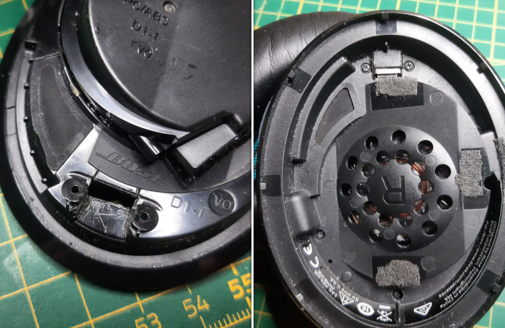

# Bose Wireless AE2 Soundlink USB Type-C Conversion

A few months after the warranty expired one of the contacts in the USB receptable broke of. This made it impossible for me to charge the device. Since there were no replacement parts available, I wanted to fix it by myself. One possible solution was to just replace the receptacle on the PCB, but I wanted to use replace the PCB completely, because these headphones were my last remaining micro USB device.

_(The original PCB with the broken micro USB receptacle)_

After desoldering the PCB I got to work. First I traced the outline of the original PCB, then I enlarged it to fit the new receptacle. Over the course of a few iterations I modified the outline in a way that it perfectly fits inside the housing.

_(The formfactor design process; 3D printing helped with the outline verification)_

After designing the PCB it arrived a few days later in much greater quantity then ordered. I chose the thickness to be as thin as possible, 0.8mm in this case.

_(More PCBs then I have headphones)_

The assembly itself was rather straight forward.

_(The assembled PCB)_

The original wires were reused when connecting the PCB to the mainboard. Since I accidentally mirrored the pinout, I had to cross the wires (as can be seen on the right image). This however didn't cause any troubles.

_(The new PCB placed inside the housing, it fits perfectly)_

One modification to the housing has to be done before it can be closed again. The new receptacle is longer then the old one. Therefore the cutout has to be enlarged. This was a fairly easy task with a sharp knife.

_(The closed modified housing, the receptacle can be seen)_

## Used USB Receptacle

I used [these receptacles](https://www.we-online.com/katalog/de/COM_3_1_THR_SMT_TYPE_C_RECEPTACLE_HORIZONTAL) from Wuerth Electronics for my board. You should order the same (or similar) to have a matching footprint.
